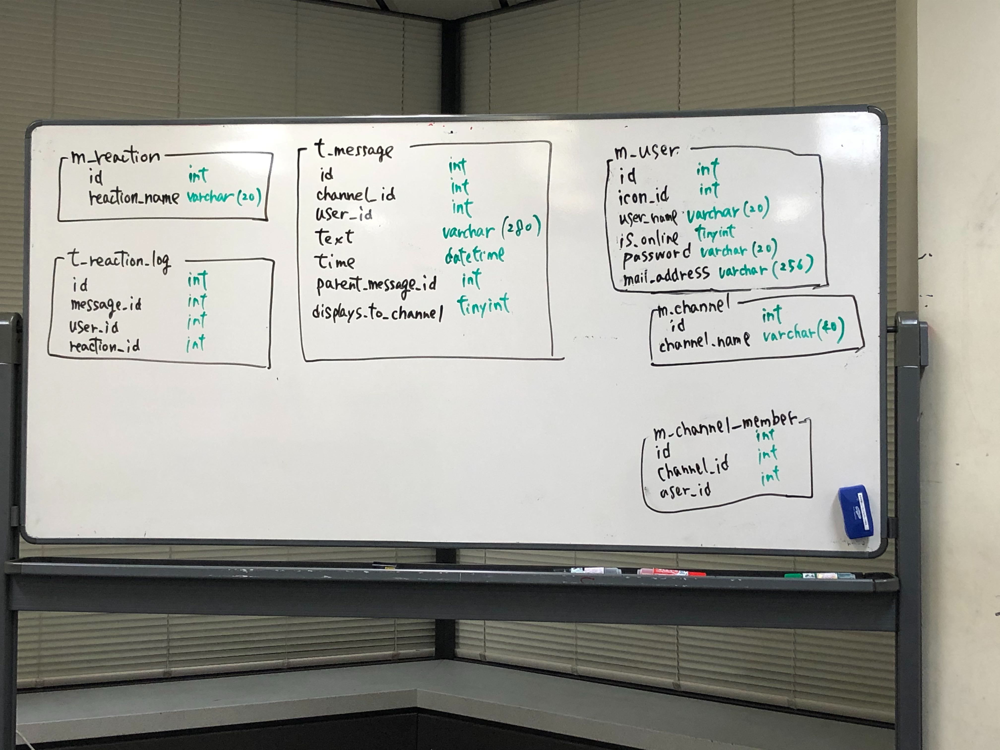

# ChatToolのER図

今後作成予定のChat applicationのDatabase modelingを行いました。  
これをER図に起こしましょう。  
ER図作成toolはMySQL WorkbenchかPlantUMLを使用して下さい。  
Toolの使い方はみんなで試行錯誤して情報共有していって下さい。

ここに個人ごとのfolderを作成し、その中にER図の画像fileを置いて下さい。  
PlantUMLで作成した場合はtext fileも置いておきましょう。

## DB仕様書
  

### 命名規則
- table名、column名は小文字のsnake case
- transaction tableはtable名にprefix `t_` を付与
- master tableはtable名にprefix `m_` を付与
