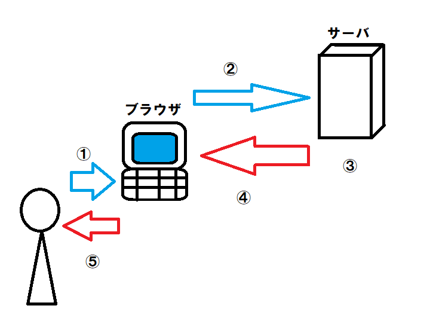

### PHPのリクエストからブラウザに表示するまでの処理の流れ

ブラウザ上からWebページを表示する流れは大まかに下図のように流れてUserに表示される。  

  

まず、PHPはブラウザ上で動作せず、サーバの中で動作するものである。  
PHPはサーバーサイド言語であるため、クライアントサイドで処理は実行されない。  
ブラウザというものは`HTML`,`CSS`,`JavaScript`の三種の言語しか翻訳することができないため、  
PHPの構文で書かれたものをそのままブラウザに送ってしまうと要求する動作をしない。  
なので、サーバはPHP構文のデータをブラウザが要求した時に`HTML`構文にデータを整形する必要がある。  
ということは、PHPの関数処理などはサーバ上で行われるということになる。

#### JavaScriptについて

JavaScriptはブラウザ上で動作するクライアントサイド言語。  
できることは、ブラウザ上で受け取り済みの`HTML`,`CSS`を変更することである。  

#### PHPとJavaScript

以上のことから、サーバサイドのPHPからJSONを返して、ブラウザ上でJavaScriptで処理して表示する流れというのは、  
1. PHPで何かしらの処理を踏み、JSONのデータを取得する。  
2. JSONデータをJavaScriptで扱い、情報を状況に応じて表示方法を変える。  
3. 整形された`HTML`構文のデータをブラウザは表示する。

