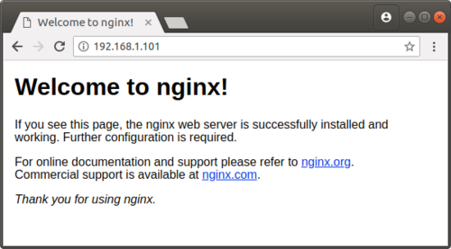
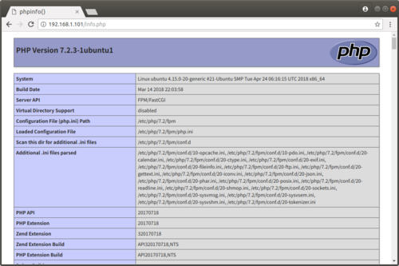

## UbuntuでNginxを使ってPHPの環境構築方法

### インストールするもの

- Nginx
- php-fpm

### Nginxとは？

Webサーバーを立てることができるアプリケーションのこと。<br>
また、APPサーバーアプリとのファイルリクエストの設定をできるようになります。(***重要***)

### php-fpmとは?

Webサーバーアプリから流れてきたファイルを.phpファイルを.htmlファイルに変換してWebサーバーアプリに返すというアプリです。

### Nginxを起動してみよう！

Ubuntu上で
```
$ sudo apt install nginx
```

これでUbuntu上にインストールされます。

その後、Nginxが正常に起動しているか確認します。
```
$ systemctl list-unit-files --type=service | grep nginx
nginx.service           enabled
```

上記のように表示されると正常に起動されています。

ブラウザで表示するには.
```
http:/[サーバーIpアドレス]/
```
をアドレスバーに入力すれば



と出るはずです。出なかったらポートフォワディングとか設定してみてください。

### 実際にブラウザからPHPをリクエストしてみよう！

今までの作業の状態では、nginxは動いているがブラウザ側がphpファイルをリクエストしてもphpファイルがダウンロードされるだけなんです。(ほしいファイルがある場合のみ)　なのできちんとブラウザ上で表示できるように色々設定しなければいけません。

#### php-fpmのインストール

php-fpmをインストールします。
```
$ sudo apt install php-fpm
```

見つからないときはアップデートしたみてください。
```
$ sudo apt update
$ sudo apt install php-fpm
```

#### php-fpmがどこで待ち受けているのかを確認しよう！

php-fpmにはリクエストが投げられたときに、そのリクエストを待っているファイルが存在します。そのファイルがきちんとリクエストを待っているか確認しましょう！

確認方法
```
$ vi /etc/php/7.2/fpm/pool.d/www.conf
; The address on which to accept FastCGI requests.
; Valid syntaxes are:
; 'ip.add.re.ss:port'    - to listen on a TCP socket to a specific IPv4 address on
;                            a specific port;
; '[ip:6:addr:ess]:port' - to listen on a TCP socket to a specific IPv6 address on
;                            a specific port;
; 'port'                 - to listen on a TCP socket to all addresses
;                            (IPv6 and IPv4-mapped) on a specific port;
; '/path/to/unix/socket' - to listen on a unix socket.
; Note: This value is mandatory.
listen = /run/php/php7.2-fpm.sock
```
このファイルの中にある「<font color ="red">listen = /run/php/php7.2-fpm.sock</font>」と書かれている行をみます。listenのイコールの後のファイルがリクエストを待っているファイルです。<br>
なので<font color="red">/run/php/php7.2-fpm.sock</font>がリクエストを待ち受けいるファイルということです。

#### php-fpmの起動確認と自動起動設定

OS起動時にサービスが起動するかを確認します。
```
$ systemctl list-unit-files --type=service | grep php
php7.2-fpm.service                     enabled
phpsessionclean.service                static
```

このように表示されると起動できています。

リクエストを待っているファイルが存在しているかを確認します。
```
$ ls /run/php | grep php
php7.2-fpm.pid
php7.2-fpm.sock
```

このように表示されるとファイルが作成されています。

#### nginxからphp-fpmにリクエストを送れるように設定しよう！

上記に書いたように、現在の設定のままではphpファイルをリクエストしてもダウンロードされるだけなんです。なのできちんとhtmlファイルに変換してくれるようにnginx側からphp-fpmにphpファイルがきたから任せるよという設定をします。

その設定を書いているファイルを開きます。
```
$ sudo vi /etc/nginx/sites-enabled/default
```

このファイルの中に、
```
# pass PHP scripts to FastCGI server
#
location ~ \.php$ {
    include snippets/fastcgi-php.conf;
#
#   # With php-fpm (or other unix sockets):
    fastcgi_pass unix:/run/php/php7.2-fpm.sock;
#   # With php-cgi (or other tcp sockets):
#   fastcgi_pass 127.0.0.1:9000;
}
```

location ~ \.php$の中かっこの中にある`fastcgi_pass unix:/`の後のファイルにリクエストを渡すよという設定になっています。
そこでphp-fpmでリクエストを待っているファイルを設定してあげます。なので確認した`/run/php/php7.2-fpm.sock`を`fastcgi_pass unix:/`の後に書いてあげることで設定完了です。

#### ブラウザからリクエストしてみよう！

設定自体は完了したので、実際にファイルを作成してブラウザからリクエストして表示できるかを確認します。

Ubuntu側でphpファイルを作成します。<br>
wwwのルートはデフォルトで「/var/www/html」となっています。

```
$ sudo vi /var/www/html/info.php
```

このファイルの中に`<?php phpinfo(); ?>`と書き込みます。
ちなみに書き込んだ内容はPHPの情報を取ってくる関数となっています。

ブラウザで表示するには
```
http:/[サーバーIpアドレス]/info.php
```
をアドレスバーに入力すれば



と出るはずです。
出来なかったら、ポートフォワディングとか設定してポート指定してみてください。

出来たら、phpが正常に動いている状態です。

---

### 参考
[Ubuntu18.04 Server + nginx + php-fpmの動作環境を構築する](https://symfoware.blog.fc2.com/blog-entry-2157.html)
