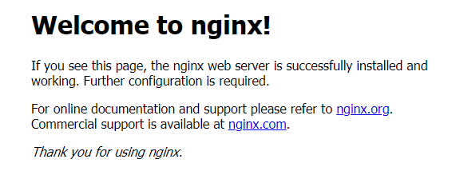
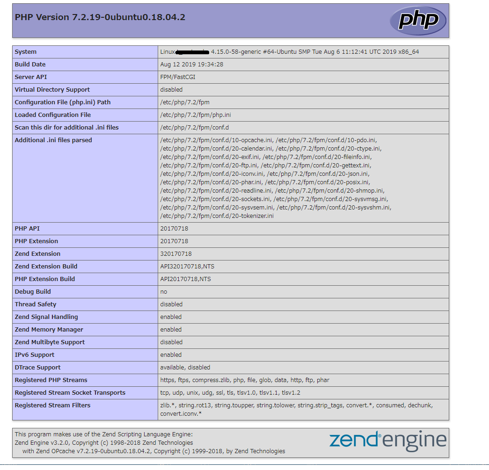

# Ubuntu上にNginxでphp開発環境を構築する手順書

Ubuntu18.04にnginxをインストールする。

## **PHP**

##### php-fpmをインストール

```
$sudo apt install php-fpm
```
を実行。  

失敗したなら更新を入れて再実行、
```
$sudo apt update
$sudo apt install php-fpm
```
  
失敗したなら更新、アップグレードをして再実行、
```
$sudo apt update
$sudo apt upgrade
$sudo apt install php-fpm
```
を実行。

インストール完了したら、バージョンを確認しておく。

```
$php -v
PHP 7.2.19-0ubuntu0.18.04.2 (cli) (built: Aug 12 2019 19:34:28) ( NTS )
Copyright (c) 1997-2018 The PHP Group
Zend Engine v3.2.0, Copyright (c) 1998-2018 Zend Technologies
    with Zend OPcache v7.2.19-0ubuntu0.18.04.2, Copyright (c) 1999-2018, by Zend Technologies
```

php-fpmの設定ファイルは`/etc/php/7.2/fpm/php-fpm.conf`
phpの設定ファイルは`/etc/php/7.2/fpm/php.ini`
に自動作成される。

---

##### 設定を確認
```
$ tail /etc/php/7.2/fpm/php-fpm.conf
; used in logs and stats. There is no limitation on the number of pools which   
; FPM can handle. Your system will tell you anyway :)

; Include one or more files. If glob(3) exists, it is used to include a bunch of
; files from a glob(3) pattern. This directive can be used everywhere in the    
; file.
; Relative path can also be used. They will be prefixed by:
;  - the global prefix if it's been set (-p argument)
;  - /usr otherwise
include=/etc/php/7.2/fpm/pool.d/*.conf
```

最終行の<font color="red">`include=/etc/php/7.2/fpm/pool.d/*.conf`</font>
で指定されているファイルを確認する。


<font color="red">`/etc/php/7.2/fpm/pool.d/`</font>には`www.conf`のみ存在しているので確認する。

```
$ vi /etc/php/7.2/fpm/pool.d/www.conf
```
viの箇所は開きたいテキストエディタを表す。vimで開きたければviをvimに変更する。
```
; The address on which to accept FastCGI requests.
; Valid syntaxes are:
;   'ip.add.re.ss:port'    - to listen on a TCP socket to a specific IPv4 address on
;                            a specific port;
;   '[ip:6:addr:ess]:port' - to listen on a TCP socket to a specific IPv6 address on
;                            a specific port;
;   'port'                 - to listen on a TCP socket to all addresses
;                            (IPv6 and IPv4-mapped) on a specific port;
;   '/path/to/unix/socket' - to listen on a unix socket.
; Note: This value is mandatory.
listen = /run/php/php7.2-fpm.sock
```

FastCGIリクエストのパラグラフ内の`listen`の内容を見る。  
<font color="red">`listen = /run/php/php7.2-fpm.sock`</font>でリクエストの受信をしているので覚えておく。

---

##### php-fpmの起動と自動起動設定


systemctlで自動で起動されるか確認する。

```
$ systemctl list-unit-files --type=service | grep php
php7.2-fpm.service                     enabled
phpsessionclean.service                static
```
`.sock`ファイルがきちんと存在するか確認する。
```
$ ls /run/php | grep php
php7.2-fpm.pid
php7.2-fpm.sock
```

存在してないならば`purge`して再インストール

---

## **nginx**

##### インストール
```
$ sudo apt install nginx
```
サービスの状態を確認。
```
$ systemctl list-unit-files --type=service | grep nginx
nginx.service                         enabled
```
ブラウザで`http://[サーバーIP]/`を表示する。  
VirtualBoxなどで仮想マシンを立てているならば、  
Ubuntuの80番ポートに対して、ポートフォアディング(仮に8000とする)した上で  
`http://localhost:8000/`と指定する。




が出れば成功。

---
##### 設定

phpのリクエストがきたら、php-fpmにリクエストを転送するよう設定する。  
編集する設定ファイルは`/etc/nginx/sites-enabled/default`


```
$ sudo vi /etc/nginx/sites-enabled/default
```
編集をするので、`sudo`を付けるか、ファイルの編集権限をユーザーに設定しておくこと。

60行目あたりにある。
```
    # pass PHP scripts to FastCGI server
        #
        location ~ \.php$ {
                include snippets/fastcgi-php.conf;
        #
        #       # With php-fpm (or other unix sockets):

        #fastcgi_pass unix:/var/run/php/php7.2-fpm.sock;
        #       # With php-cgi (or other tcp sockets):
        #fastcgi_pass 127.0.0.1:9000;
        }
```
の中にある。  
<font color="red">`fastcgi_pass unix:/var/run/php/php7.2-fpm.sock;`</font>  
先頭の＃を消し、コメントを解除する。  
`unix:`以下の`php7.2-fpm.sock`へのパスをphpの設定で覚えた通りに変更する。
```
    # pass PHP scripts to FastCGI server
        #
        location ~ \.php$ {
                include snippets/fastcgi-php.conf;
        #
        #       # With php-fpm (or other unix sockets):

        fastcgi_pass unix:run/php/php7.2-fpm.sock;
        #       # With php-cgi (or other tcp sockets):
        #fastcgi_pass 127.0.0.1:9000;
        }

```

編集が完了したら
```
$sudo service nginx reload
```
で設定の再読み込みをする。


---

##### 動作確認

きちんとphpないしnginxが起動しているか確認する。

まず、`/var/www/html`に`info.php`というファイルを作成する。

`info.php`ではphpの情報を表示させたいので
```
<?php phpinfo(); ?>
```
だけを書いて保存。

ブラウザから`http://[サーバーIP]/info.php`を表示する。




が表示されれば完了。


---

## 参考
[Symfoware:Ubuntu18.04 Server + nginx + php-fpmの動作環境を構築する](https://symfoware.blog.fc2.com/blog-entry-2157.html)
