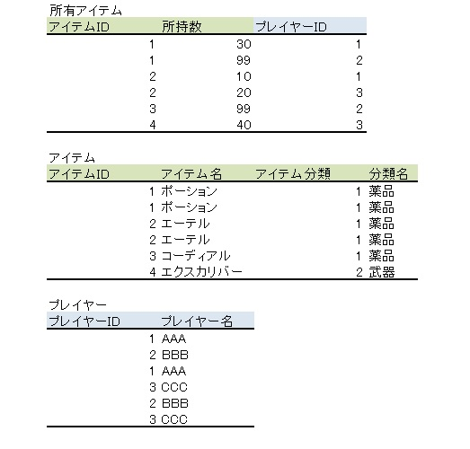

### データベースの正規化について

正規化とは、「効率よくデータを扱うためにデータを整理すること」

#### 非正規形

非正規形とは、データベースに登録のできない形の表である。

#### 第一正規形

表をデータベースに登録できるように調整した形

このテーブルの主キーは{取引先番号,商品番号}の組み合わせの複合キーとなり、
とあるカラムのパラメータがわかれば自然に導き出せる仕組みを、**関数従属性**と呼ぶ。

簡潔に言えば、「商品コードがわかれば、商品名や単価がわかる」ということ。

**導出項目**はこの時点で削除しておく。

* **導出項目**　他のカラムのパラメータによる計算によって算出できる項目のこと。
    取引金額は単価＊個数で求めることができるので導出項目である。

#### 第二正規形

第一正規形から**部分関数従属**するものを取り除くこと。

* **部分関数従属**する状態とは、複合キーの片方が決まれば決まってしまうカラムのこと。

この部分関数従属するものを異なるテーブルに分割することが第二正規形にすることである。

#### 第三正規形

第二正規形から推移関数従属性を取り除くこと。

* **推移関数従属性**とは、主キーではないものの中でも関数従属するもののこと。

推移関数従属するものを異なるテーブルに分けることが第三正規形にすることである。  

#### その他の正規形

第四正規形、第五正規形が存在するが、実用的であると見なされることは少ないため、
無視することが多い。  

---
#### 参考

[OSS-DB](https://oss-db.jp/dojo/dojo_info_04)  
[GOMOKULOG](http://gomocool.net/gomokulog/?p=514)  
[Qiita:正規化の要点を理解する](https://qiita.com/mochichoco/items/2904384b2856db2bf46c)
