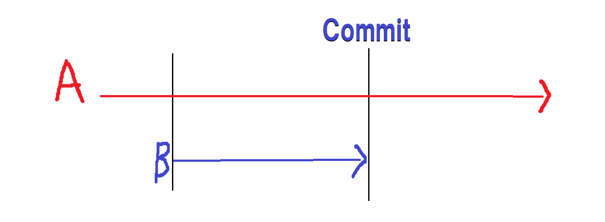

## Transactionについて

### Transaction  

単語の意味としては、売買取引や複数形で議事録を表す。  
ITの分野においては、**分割することのできない複数の処理を一つにまとめたもの**と定義される。
一つにまとめられた処理は、「途中で失敗した」、「一部処理だけ完遂した」といった結果を残さず。
その処理全体で**成功**か**失敗**の2択のみ結果を表す。  
成功ならばそれで良いのだが、失敗したならば、処理の実行前の状態に戻さなくてはならない。  

銀行で口座振込を行う場合、  
* 口座Aには30,000円、口座Bには20,000円の残高がある。  
口座Aから口座Bに5,000円を送るとき、

       1. 口座Aの残高から5,000円を引く。
       2. 上記処理が完了したならば、口座Bの残高を5,000円増やす。

上記の処理をTransactionとして扱い、  
仮に、2の処理が失敗したならば、1の処理で減らした金額を元に戻さなくてはならない。  

　分離できない複数の処理というのは上記のように、  
　処理の一連の流れのうちどこかが失敗したときに成功できた処理をRollbackする必要が出てくる最小の単位である。  

---

### ACID特性
Transaction処理に求められる特性のこと。

* **原子性 (Atomicity)**  
Transactionに含まれる個々の手順が「**すべて実行される**」か「**一つも実行されない**」のどちらかの状態になるという性質である。

* **一貫性 (Consistency)**  
Transactionの実行前と後でデータに矛盾がなく整合性が保たれる性質である。

* **分離性 (Isolation)**  
Transaction実行中の処理過程が外部から隠蔽され、他の処理などに影響を与えない性質である。

* **永続性 (Durability)**  
Transactionが完了すると、その処理結果は永続的となります。たとえシステム障害が発生してもデータが失われることがない性質である。  

---

### Transaction分離Level

データベース管理システム上での一括処理が複数同時に行われた場合に、どれほどの一貫性、正確性で実行するかを4段階で定義したものである。隔離レベル、独立性レベルとも呼ばれる。  
Transactionを定義づけるACID特性のうち,分離性に関する概念である。

#### 同時実行されたTransaction間における現象

* ##### Dirty Read  
異なるTransactionの未Commitデータを読み取ってしまう現象

* ##### Fuzzy Read / Non-Repeatable Read  
下の図のTransactionAの実行中にTransactionBで**データの更新**をCommitしたときに、  
実行中のTransactionAでTransactionBのCommit済みデータを読み取ってしまう現象  

* ##### Phantom Read  
下の図のTransactionAの実行中にTransactionBで**データの追加・削除**をCommitしたときに、  
実行中のTransactionAでTransactionBのCommit済みデータを読み取ってしまう現象  

上記の３つの問題をどれだけ許容するかの程度がTransaction分離Levelである。

---

### 分離Levelの段階

ANSI/ISO SQL標準で分離レベルは、下記の4種類で定義されている。

* ##### READ UNCOMMITTED (確定していないデータまで読み取る)  
    他の処理によって行われている、書きかけのデータまで読み取る。  

* ##### READ COMMITTED ( 確定した最新データを常に読み取る)  
    他のTransaction更新については、常にコミット済みのデータのみを読み取る。  
  MVCC[^1]はREAD COMMITTEDを実現する実装の一つである。  

* ##### REPEATABLE READ (読み取り対象のデータを常に読み取る)  
    ひとつのTransaction実行中の間、読み取り対象のデータが途中で他のTransaction変更される心配はない。  
同じTransaction中では同じデータは何度読み取りしても毎回同じ値を読むことができる。  

* ##### SERIALIZABLE (直列化可能)  
    複数の並行に動作するTransaction結果が、いかなる場合でも、それらのTransaction時間的重なりなく逐次実行した場合と同じ結果となる。  
このような性質を直列化可能性と呼ぶ.SERIALIZABLEは最も強い分離Levelであり、最も安全にデータを操作できるが、相対的に性能は低い。ただし同じ結果とされる逐次実行の順はTransaction処理のLevelでは保証されない。  
  
|分離Level|Dirty Read|Fuzzy Read|Phantom Read|
|:--|:-:|:-:|:-:|
|READ UNCOMMITTED|○|○|○|
|READ COMMITTED|x|○|○|
|REPEATABLE READ[^2]|x|x|○|
|SERIALIZABLE|x|x|x|
  

[^1]: MultiVersion Concurrency Control(Transactionが行われている最中に他のUserによる読み取りがあった場合、書き込みの直前の状態を処理結果として返す。書き込み中も読み取りができ、読み取り中でも書き込みができる)  
[^2]: InnoDBはREPEATABLE READでもMVCC[^1]によってPhantom Readが発生しない。

---

### 対処

1. データの更新前にテーブル情報を読み取る。  
データの操作前に読み取りを入れ、Transactionの開始時と内容の変化があれば処理を頭からやり直すことで影響を緩和する。

2. データを書き換えられないようにロックする。  
データへの読込・更新処理を開始した時にそのデータへのAccessを排除する。排除されたAccessはUnlockされたら処理される。

3. 並列的にTransactionを走らせない。  
並列に複数のTransactionが走っていることで問題が起きているのだから1つのTransactionしか走らないようにすることでTransactionの分離を考慮しなくて良くなる。  

